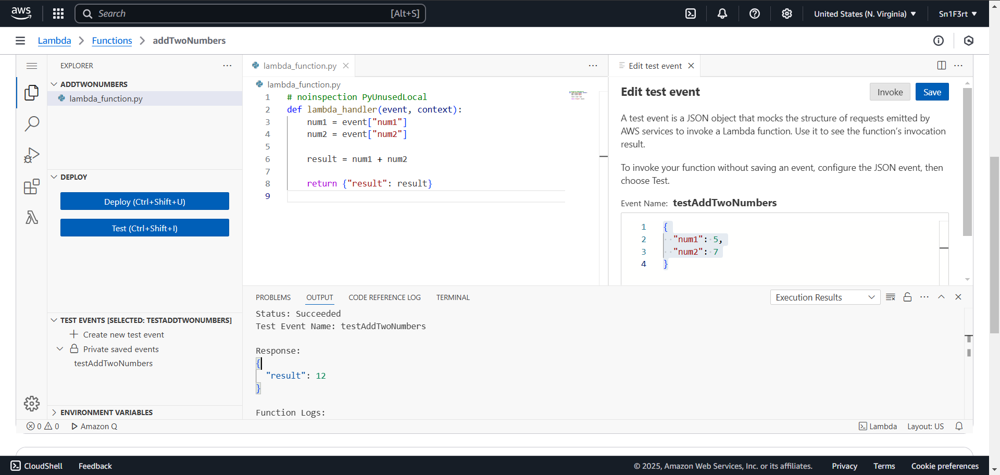
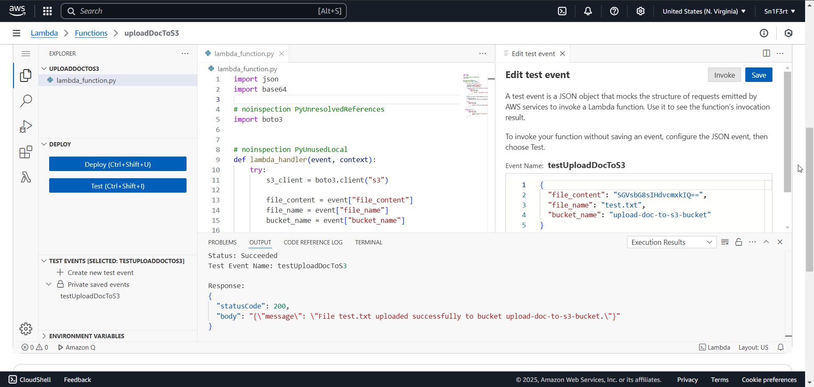

## Add Two Numbers Script

Simply create a new lambda function and paste the code inside of [`addTwoNumbers.py`](addTwoNumbers.py). Click Deploy and add a test case with the following content, 

```json
{
  "num1": 5,
  "num2": 7
}
```

Click Test and you should get the response as 

```json
{
  "result": 12
}
```



## Upload Document to Amazon S3

Create a new lambda function and paste the code inside of [`uploadDocToS3.py`](uploadDocToS3.py). Click Deploy and add a test case with the following content, 

```json
{
    "file_content": "SGVsbG8sIHdvcmxkIQ==",
    "file_name": "test.txt",
    "bucket_name": "upload-doc-to-s3-bucket"
}
```

The file content is base64 encoded data for `Hello, world!`.

Create a S3 bucket called `upload-doc-to-s3-bucket`. On the lambda page, go to `Configuration > Permissions`, click on the IAM user role and add a policy `AmazonS3FullAccess`.

Click Test and you should get the response as 

```json
{
    "statusCode": 200,
    "body": "{\"message\": \"File test.txt uploaded successfully to bucket upload-doc-to-s3-bucket.\"}"
}
```

The file `test.txt` should be uploaded to the S3 bucket.


